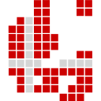

<p align="center">
  
  <h1 align="center">react-denmark-map</h1>
  <p align="center">
    Customizable plug-and-play map of Denmark for visual presentation 🗺️
    <br />
    <br/>
    ✨ <a href="https://react-denmark-map-demo.vercel.app/">Demo</a> ✨
  </p>
</p>

## Table of contents

- [Installation](#installation)
- [Usage](#usage)
  - [Basic usage](#basic-usage)
  - [Customizing areas](#customizing-areas)
  - [Customizing the tooltip](#customizing-the-tooltip)
  - [Click and hover events](#click-and-hover-events)
  - [Zooming](#zooming)
  - [Styling](#styling)
- [Typescript](#typescript)
- [Performance](#performance)
- [API](#api)
  - [Components](#components)
  - [Props](#props)
  - [Types](#types)
- [License](#license)
- [Contributing](#contributing)

## Installation

```
npm install react-denmark-map
```

```
yarn add react-denmark-map
```

## Usage

_Examples use the `Municipalities` component, although the props are the same for every component. See ["API"](#components) for all available components._

### Basic usage

```jsx
import { Municipalities } from 'react-denmark-map'

const App = () => {
  return <Municipalities />
}
```

### Customizing areas

The `customizeAreas` prop is invoked for each area and applies a className and/or style.

```jsx
import { Municipalities } from 'react-denmark-map'

const App = () => {
  const customizeMunicipalities = (municipality) => {
    if (municipality.name === 'københavn') {
      return {
        className: 'københavn',
        style: {
          fill: 'red'
        }
      }
    }
  }

  return <Municipalities customizeAreas={customizeMunicipalities} />
}
```

Below is an example of how you can conditionally style each area with external data. Here, `id` is the name of the municipality and `population` is data about the area, we can make municipalities with a population less than 40.000 people a light blue and municipalities with a higher population a darker blue.

```jsx
import { Municipalities } from 'react-denmark-map'

const data = [
  {
    id: 'assens',
    population: 40972
  }
  // ...
]

const App = () => {
  const customizeMunicipalities = (municipality) => {
    const result = data.find((item) => item.id === municipality.name)

    if (!result) return

    if (result.population < 40000) {
      return {
        style: {
          fill: 'skyblue'
        }
      }
    }
    return {
      style: {
        fill: 'royalblue'
      }
    }
  }

  return <Municipalities customizeAreas={customizeMunicipalities} />
}
```

Instead of municipalities, these areas could also be each region or island, depending on the component used. See "API" for full reference.

### Customizing the tooltip

`customTooltip` is a prop that takes a function and returns a JSX element. The tooltip is displayed when hovering an area.

```jsx
import { Municipalities } from 'react-denmark-map'

const App = () => {
  const customTooltip = (municipality) => {
    return (
      <div className="tooltip">
        <p>Name: {municipality.display_name}</p>
        <p>Municipality code: {municipality.code}</p>
      </div>
    )
  }

  return <Municipalities customTooltip={customTooltip} />
}
```

You can easily display external data about the area on the tooltip. In this example, `id` is the name of the municipality and `population` is data about the area, where we want to display data about the population of the area in the tooltip.

```jsx
import { Municipalities } from 'react-denmark-map'

const data = [
  {
    id: 'assens',
    population: 40972
  }
  // ...
]

const App = () => {
  const customTooltip = (municipality) => {
    const result = data.find((item) => item.id === municipality.name)

    return (
      <div>
        <p>{municipality.display_name}</p>
        <p>Population: {result?.population ? result.population : 'N/A'}</p>
      </div>
    )
  }

  return <Municipalities customTooltip={customTooltip} />
}
```

The first parameter / the area parameter of the `customTooltip` function (here named `municipality`) contains several fields that can be used to identify the correct area. See "API" for full reference.

Disable the tooltip by passing `showTooltip={false}` as a prop.

### Click and hover events

#### `onClick` event handler

An event handler that is called when an area is clicked.

```jsx
import { Municipalities } from 'react-denmark-map'

const App = () => {
  return (
    <Municipalities
      onClick={(municipality) => console.log(`Clicked: ${municipality.display_name}`)}
    />
  )
}
```

#### `onHover` event handler

An event handler that is called when an area is hovered on.

```jsx
import { Municipalities } from 'react-denmark-map'

const App = () => {
  return (
    <Municipalities
      onHover={(municipality) => console.log(`Hovered: ${municipality.display_name}`)}
    />
  )
}
```

#### `onMouseEnter` and `onMouseLeave` event handlers

Event handlers that are called when areas are entered and left by the cursor, respectively. `onHover` is the same as `onMouseEnter`.

```jsx
import { Municipalities } from 'react-denmark-map'

const App = () => {
  return (
    <Municipalities
      onMouseEnter={(municipality) => console.log(`Mouse entered: ${municipality.display_name}`)}
      onMouseLeave={(municipality) => console.log(`Mouse left: ${municipality.display_name}`)}
    />
  )
}
```

### Zooming

The `CustomZoomControls` prop allows you to customize the default zoom controls.

```jsx
import { Municipalities } from 'react-denmark-map'

const CustomZoomControls = ({ onZoomIn, onZoomOut }) => (
  <div style={{ display: 'flex', flexDirection: 'column' }}>
    <button onClick={() => onZoomIn()}>+</button>
    <button onClick={() => onZoomOut()}>–</button>
  </div>
)

const App = () => {
  return <Municipalities CustomZoomControls={CustomZoomControls} />
}
```

Pass the prop `zoomable={false}` to disable zooming (and thus not render zoom controls).

### Styling

#### Positioning

It's strongly recommended that you wrap the map in an element and position that according to your needs. Applying a max width and a margin will center the map and preserve it's dimensions across screen sizes.

```jsx
<div style={{ maxWidth: '600px', margin: '0 auto' }}>
  <Municipalities />
</div>
```

#### Appearance

The exported components also support a number of different ways of styling the map.

```jsx
import { Municipalities } from 'react-denmark-map'

const App = () => {
  return <Municipalities className="denmark" style={{ marginTop: '20px' }} color="lightgray" />
}
```

- `className` is a string which is applied directly to the SVG element.
- `style` is an object of CSS properties which is applied directly to the SVG element.
- `color` is the default color applied to each area of the map.
- `clickable` specifies whether `cursor: pointer` should be applied when hovering. True if `onClick` is passed.
- `hoverable` specifies whether hover styles should be applied when hovering. True by default.

Alternatively, you can apply styles to some of the components' HTML tags. Some tags are available through their HTML `id` attribute.

- `react-denmark-map-svg` is the `svg` element which contains the path of each area.
- `react-denmark-map` is the top-most `figure` element and the parent of `svg`.
- `react-denmark-map-tooltip` is the default tooltip `div` element.

## Typescript

React Denmark Map is written in Typescript.

You may also want to apply types to function arguments i.e. when writing the function to be given to the `customizeAreas` prop. In that case, React Denmark Map exports the type used as an argument as `*Type`, e.g. for the `Municipalities` component.

```jsx
import { Municipalities, MunicipalityType } from 'react-denmark-map'

const App = () => {
  const customizeMunicipalities = (municipality: MunicipalityType) => {
    // ...
  }

  return <Municipalities customizeAreas={customizeMunicipalities} />
}
```

All props that accept a function as an argument have the same type in that component, so the same type can be applied to the parameter used in `customTooltip`, `onClick`, and `onHover`.

Different components have different types for the area parameter. The `Regions` component, for example, exports a `RegionsType` that can be used in the same way as shown above. See "API - Types" for the full reference of area types.

## Performance

If you want to make sure that each version of the map rerenders as few times as possible to improve performance, make sure to memoize the objects and functions that you pass as props with [`useMemo`](https://react.dev/reference/react/useMemo) and [`useCallback`](https://react.dev/reference/react/useCallback). Each component is only shallowly memoized. Below is an example of memoizing the `customizeAreas` and `style` props.

```jsx
const App = () => {
  const style = useMemo(() => ({ color: 'red' }), [])

  const customizeAreas = useCallback(() => {
    return {
      style: {
        fill: 'red'
      }
    }
  }, [])

  return <Municipalities customizeAreas={customizeAreas} style={style} />
}
```

## API

### Components

React Denmark Map exports several components, each being a map of Denmark with different areas that all support the same props as those shown above:

| Component        | Description                                        |
| ---------------- | -------------------------------------------------- |
| `Municipalities` | All 98 municipalities of Denmark.                  |
| `Constituencies` | The 10 constituencies of Denmark.                  |
| `Regions`        | The five regions of Denmark.                       |
| `Islands`        | Zealand, Fyn and Jutland (Sjælland, Fyn, Jylland). |
| `Denmark`        | A map of Denmark with no subsequent areas.         |

### Props

| Prop                  | Description                                                                                             | Type                                                                          | Default                                        |
| --------------------- | ------------------------------------------------------------------------------------------------------- | ----------------------------------------------------------------------------- | ---------------------------------------------- |
| `className`           | The `className` applied directly to the `<svg>` element.                                                | string                                                                        | ""                                             |
| `style`               | The style object applied directly to the `<svg>` element.                                               | CSSProperties<sup>\*</sup>                                                    | {}                                             |
| `viewbox`             | The viewbox applied directly to the `<svg>` element.                                                    | { top?: number, left?: number, width?: number, height?: number }              | { top: 0, left: 0, width: 1000, height: 1215 } |
| `color`               | The default color of each municipality.                                                                 | CSSProperties["fill"]                                                         | #ccc                                           |
| `clickable`           | Whether the clickable styles should be applied to the `<path>` element (the area).                      | boolean                                                                       | false                                          |
| `hoverable`           | Whether the hoverable styles should be applied to the `<path>` element (the area).                      | boolean                                                                       | true                                           |
| `showTooltip`         | Whether to render the tooltip.                                                                          | boolean                                                                       | true                                           |
| `bornholmAltPosition` | Whether to render Bornholm closer to Zealand in the `Municipalities` component.\*\*                     | boolean                                                                       | false                                          |
| `laesoeAltPosition`   | Whether to render Læsø slightly closer to Jylland in the `Municipalities` component.                    | boolean                                                                       | false                                          |
| `anholtAltPosition`   | Whether to render Bornholm closer to Zealand in the `Municipalities` component.                         | boolean                                                                       | false                                          |
| `zoomable`            | Whether you should be able to zoom on the map.                                                          | boolean                                                                       | true                                           |
| `CustomZoomControls`  | A React component for custom zoom controls.                                                             | ComponentType<{ onZoomIn(): void; onZoomOut(): void }>                        |                                                |
| `customTooltip`       | A function that returns a custom tooltip.                                                               | (area: AreaType<sup>\*\*\*</sup>) => ReactNode                                |                                                |
| `customizeAreas`      | A function that is invoked for every area and returns an object to style the area.                      | (area: AreaType) => { className?: string, style? CSSProperties } \| undefined |                                                |
| `filterAreas`         | A function that is invoked for every area that avoids rendering the area if the function returns false. | (area: AreaType) => boolean                                                   |                                                |
| `onClick`             | A function that is invoked when an area is clicked.                                                     | (area: AreaType) => void                                                      |                                                |
| `onHover`             | A function that is invoked when an area is hovered.                                                     | (area: AreaType) => void                                                      |                                                |
| `onMouseEnter`        | A function that is invoked when the mouse enters an area.                                               | (area: AreaType) => void                                                      |                                                |
| `onMouseLeave`        | A function that is invoked when the mouse leaves an area.                                               | (area: AreaType) => void                                                      |                                                |

\*: CSSProperties refers to the object provided to the style attribute in React. Fields in this object are denoted as CSSProperties["property"].

\*\*: It will be out of the viewbox when first rendered so you need to manually set the viewbox to render it. See example for use case.

\*\*\*: AreaType is one of the five types corresponding to the component used (see "Types" below).

### Types

Each area has at least the first 5 properties and potentially more.

```ts
type AreaType = {
  id: string // the name of the area with substitutes for Danish letters (e.g. 'fanoe')
  name: string // the name of the area with Danish letters (e.g. 'fanø')
  en_name: string // same as 'id'
  display_name: string // the local name of the area capitalized (e.g. 'Høje Taastrup')
  d: string // the path of the area applied to the <path> element
  code: string // the municipality or region code (e.g. 482 or 1083)
  en_term: string // the term used to describe the area in English (e.g. jyllland = jutland)
  region: RegionType // the region that a municipality is located in (e.g. fanø -> syddanmark)
  altD: string // a possible alternative path for the area in the map
}
```

The types corresponding to each component are:

| Component                    | Name of exported type | Included in type                                           |
| ---------------------------- | --------------------- | ---------------------------------------------------------- |
| `Municipalities`             | MunicipalityType      | { id, name, en_name, display_name, d, code, region, altD } |
| `Constituencies`<sup>\*<sup> | ConstituencyType      | { id, name, en_name, display_name, d }                     |
| `Regions`                    | RegionType            | { id, name, en_name, display_name, d, code }               |
| `Islands`                    | IslandType            | { id, name, en_name, display_name, d, en_term }            |
| `Denmark`                    | DenmarkType           | { id, name, en_name, display_name, d, en_term }            |

\*: When filtering using any of the strings in the ConstituencyType be aware that the constituencies (danish: "storkredse"), e.g. "sydjyllands storkreds", have the word "storkreds" omitted in the properties `id`, `name` and `en_name`. Thus, "sydjyllands storkreds" is just "sydjyllands" and so on.

Using the `Denmark` component means that there's only one path element, so DenmarkType describes just that one area.

All entries for the areas can be found under 'packages/core/src/components/_[area]_/data.ts'.

## License

React Denmark Map is licensed under the [MIT license](https://github.com/MartinP460/react-denmark-map/blob/main/LICENSE.md).

## Contributing

Contributions are really appreciated! Read [CONTRIBUTING.md](https://github.com/MartinP460/react-denmark-map/blob/main/CHANGELOG.md) for more information.
